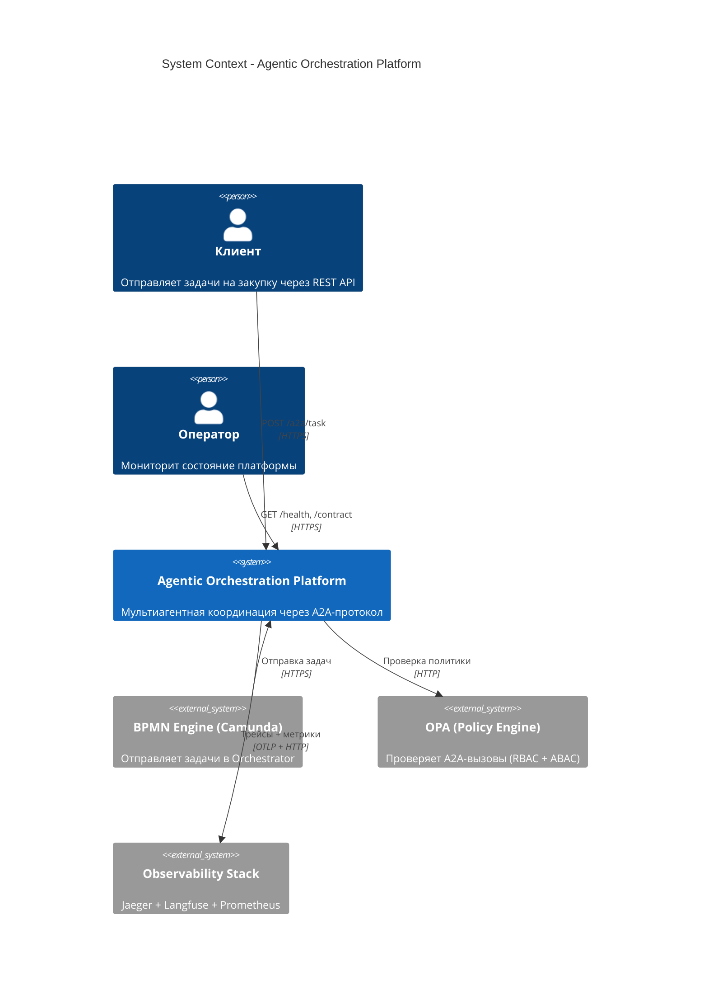
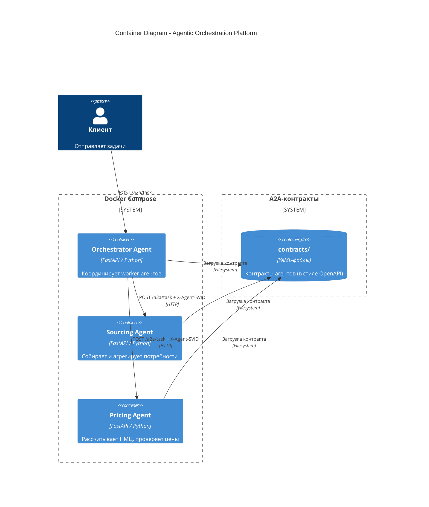
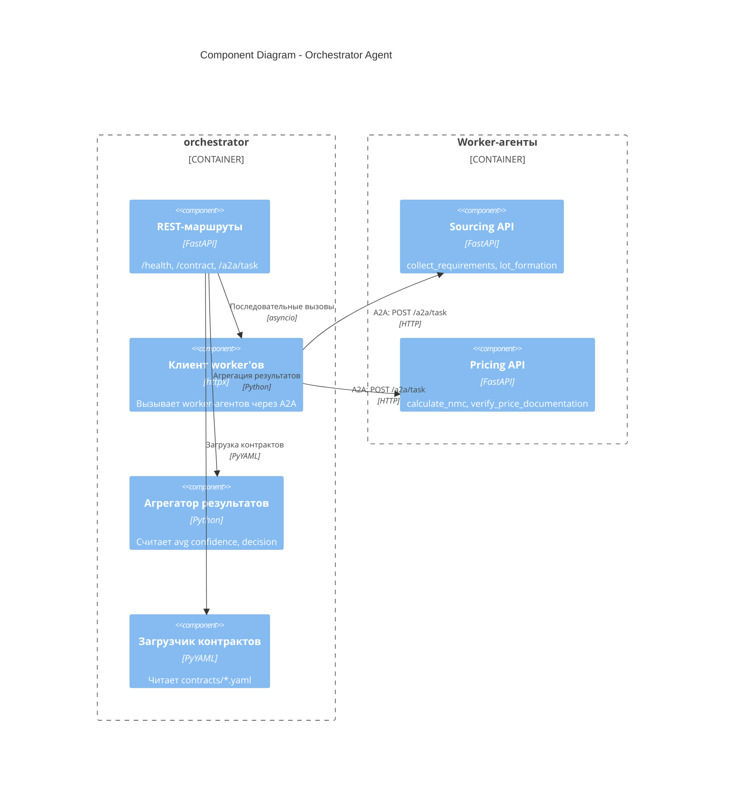

# Agentic Orchestration Platform

**Мультиагентная платформа оркестрации** с протоколом A2A (Agent-to-Agent), формальными контрактами и WIMSE-совместимой идентичностью.

Референсная реализация паттернов оркестрации из [enterprise-agent-orchestration-blueprint](https://github.com/realrvs/enterprise-agent-orchestration-blueprint) — **раздел 3.1 (Иерархическая оркестрация)** и **раздел 3.2 (A2A-протокол)**.

---

## Содержание

1. [Обзор архитектуры](#обзор-архитектуры)
2. [C4-диаграммы](#c4-диаграммы)
3. [A2A-протокол](#a2a-протокол)
4. [Быстрый старт](#быстрый-старт)
5. [Тестирование](#тестирование)
6. [Дорожная карта](#дорожная-карта)
7. [Связь с Blueprint](#связь-с-blueprint)

---

## Обзор архитектуры

Ключевые принципы:

- **Orchestrator Agent** — координирует worker-агентов, маршрутизирует задачи, агрегирует результаты
- **Worker Agents** — каждый отвечает за узкую задачу (сорсинг, ценообразование, комплаенс, ...)
- **Формальные контракты** — каждый агент публикует YAML-контракт (в стиле OpenAPI/AsyncAPI)
- **Передача SVID** — каждый A2A-вызов несёт заголовок `X-Agent-SVID` (WIMSE)
- **Агрегация confidence** — Orchestrator вычисляет средний confidence по всем worker'ам
- **Эскалация** — если confidence < порога, решение = `escalate` (ручной review)

---

## C4-диаграммы

### Уровень 1 — System Context

Кто использует платформу и какие внешние зависимости существуют.



### Уровень 2 — Container

Что развёрнуто и как компоненты общаются.



### Уровень 3 — Component

Какие компоненты находятся внутри каждого контейнера.



---

## A2A-протокол

### Пример контракта

Каждый агент публикует YAML-контракт:

```yaml
agent_id: "sourcing_agent_v1"
name: "Sourcing Agent"
version: "1.0"
capabilities:
  - collect_requirements
  - aggregate_needs
  - verify_nomenclature

input_schema:
  type: object
  properties:
    lot_id: { type: string }
    category: { type: string }

output_schema:
  type: object
  properties:
    lot_data: { type: object }
    nomenclature_ok: { type: boolean }
    confidence: { type: number }

security:
  required_svid: "spiffe://company.ru/agents/sourcing_v1"
  audit_level: "full"
```

### A2A-вызов

Orchestrator вызывает worker через HTTP с SVID в заголовке:

```
POST /a2a/task
X-Agent-SVID: spiffe://company.ru/agents/orchestrator_v1
Content-Type: application/json

{
  "task": { "lot_id": "LOT-001", "category": "IT" },
  "caller_svid": "spiffe://company.ru/agents/orchestrator_v1"
}
```

### Многошаговая координация

Orchestrator выполняет **многошаговые задачи**:

```
task_type=procurement
    ├─ Шаг 1: Sourcing Agent
    │    └─ Если nomenclature_ok = true
    │
    └─ Шаг 2: Pricing Agent
         └─ Расчёт НМЦ
    ↓
Агрегация: avg confidence = (0.92 + 0.88) / 2 = 0.90
Решение: approve (>= 0.85)
```

---

## Быстрый старт

### Требования

- Docker Desktop ≥ 4.89
- PowerShell (Windows) или Bash (Linux/macOS)

### 1. Запустить платформу

```powershell
docker compose up --build -d
docker compose ps
```

Ожидаемый вывод:
```
NAME              STATUS    PORTS
aop-orchestrator  Up        0.0.0.0:9000->9000/tcp
aop-pricing       Up        0.0.0.0:9002->9002/tcp
aop-sourcing      Up        0.0.0.0:9001->9001/tcp
```

### 2. Проверить health

```powershell
Invoke-RestMethod -Uri "http://localhost:9000/health"
Invoke-RestMethod -Uri "http://localhost:9001/health"
Invoke-RestMethod -Uri "http://localhost:9002/health"
```

### 3. Получить контракт агента

```powershell
Invoke-RestMethod -Uri "http://localhost:9000/contract" | ConvertTo-Json -Depth 10
```

### 4. Запустить мультиагентную задачу

```powershell
$json = '{"task_type":"procurement","payload":{"lot_id":"LOT-001","category":"IT","amount":1500000},"context":{}}'

Invoke-RestMethod -Uri "http://localhost:9000/a2a/task" `
    -Method Post `
    -ContentType "application/json" `
    -Body $json | ConvertTo-Json -Depth 10
```

---

## Тестирование

### Ожидаемый ответ

```json
{
  "decision": "approve",
  "confidence": 0.9,
  "reasoning": "sourcing: OK; pricing: OK",
  "worker_results": [
    {
      "worker": "sourcing",
      "svid": "spiffe://company.ru/agents/sourcing_v1",
      "response": {
        "lot_data": {"lot_id": "LOT-001", "category": "IT", "items_count": 5},
        "nomenclature_ok": true,
        "confidence": 0.92
      },
      "success": true
    },
    {
      "worker": "pricing",
      "svid": "spiffe://company.ru/agents/pricing_v1",
      "response": {
        "nmc_value": 1425000.0,
        "justification": "Calculated using method_1",
        "confidence": 0.88
      },
      "success": true
    }
  ]
}
```

### Проверить логи

```powershell
docker logs aop-orchestrator --tail 30
docker logs aop-sourcing --tail 20
docker logs aop-pricing --tail 20
```

---

## Связь с Blueprint

| Раздел blueprint | Реализация |
|------------------|-----------|
| **3.1 Иерархическая оркестрация** | Orchestrator + Worker-агенты |
| **3.2.1 Контракты агентов** | YAML-контракты в `contracts/` |
| **3.2.2 Шина сообщений** | A2A на HTTP (в production: RabbitMQ) |
| **4.2 WIMSE-идентичность** | Заголовок `X-Agent-SVID` на каждом вызове |
| **4.3 Immutable Audit** | Запланировано (append-only log) |

---

## Ссылки

- **Blueprint:** [github.com/realrvs/enterprise-agent-orchestration-blueprint](https://github.com/realrvs/enterprise-agent-orchestration-blueprint)
- **Reference PoC (BPMN + LLM + Policy):** [github.com/realrvs/agentic-orchestration-poc](https://github.com/realrvs/agentic-orchestration-poc)
- **MCP Gateway PoC:** [github.com/realrvs/mcp-gateway-poc](https://github.com/realrvs/mcp-gateway-poc)
